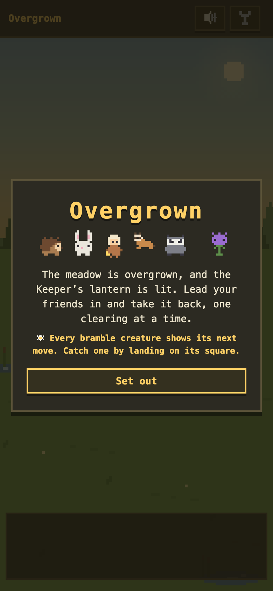
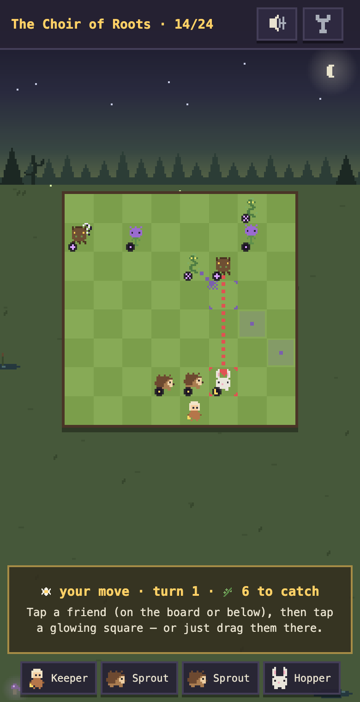
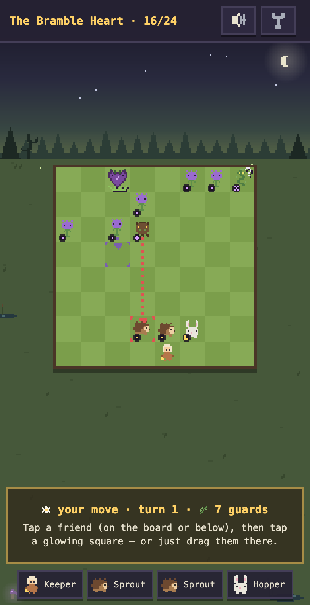

# Overgrown 🌼

A cozy pixel-art tactics roguelike. Lead a band of meadow critters against the
Bramble — every friend moves in a pattern you might just recognize, but nobody
here has ever heard of chess.

**Play it: [thistledown.vercel.app](https://thistledown.vercel.app)** — built
for a phone, works anywhere.

| | | |
|---|---|---|
|  |  |  |

## How it plays

Short tactical fights on small boards, Into the Breach rules of engagement:
every enemy telegraphs its next move, so each turn is a puzzle with perfect
information. Catch a bramble creature by landing on its square; nothing dies —
enemies poof into flowers, and captured friends just sit out a fight, Shaken.
Between fights you recruit, pick trinkets, and brew upgrades at the campfire.

Sister project to [Cozy Sprites](https://github.com/conro1108/cozy_sprites):
same 16×16 aesthetic universe, same dry/warm tone. Where Cozy Sprites is a
check-in-every-few-hours game, this is a sit-down-for-40-minutes game.

## Current state

The full run is playable: **6 regions × 4 clearings = 24 fights**, a boss per
region, camps before bosses, region-shaped recruit pools. Difficulty comes from
independent axes rather than just bigger enemy counts — enemy acts-per-turn,
AI dials (foresight, caution, bloodlust), telegraph degradation (full → fickle
→ shrouded), and an anti-stall spread clock. Progression items: trinkets,
camp treats, and per-kind movement upgrades. Mobile UX, coach bubbles, and
sound are in.

See `DESIGN.md` for the vision and `PLAN.md` for the build log.

## Run it

```bash
npm install
npm run dev      # dev server
npm test         # unit tests (Vitest)
npm run build    # typecheck + production build
```

`src/game/` is pure and DOM-free (that's where the tests live); `src/render/`
draws; `src/ui/` wires. Deploys as a static site (Vercel, Vite preset).
